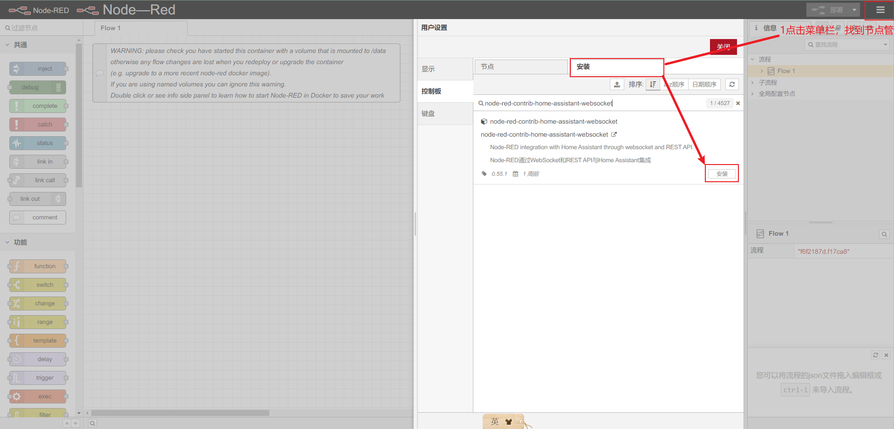
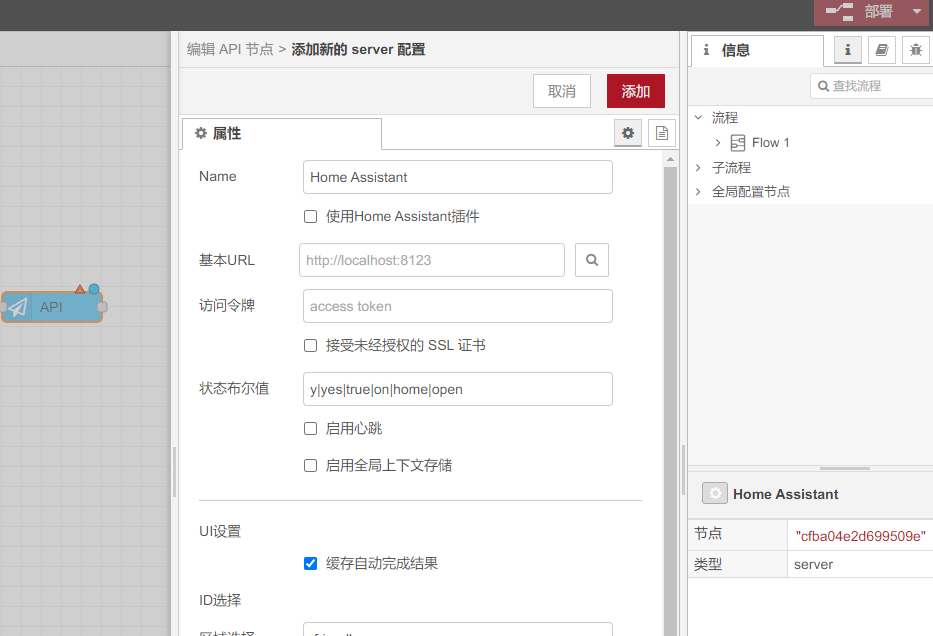

# Homeassistant极简安装法

## 1.准备一台windows、Mac、Linux设备

## 2.安装docker

```bash
# 国外环境
wget -qO- get.docker.com | bash
# 国环境环境
curl -fsSL https://get.docker.com -o get-docker.sh
sh get-docker.sh --mirror=Aliyun
```

## 3.配置镜像源

```bash
sudo mkdir -p /etc/docker
sudo tee /etc/docker/daemon.json <<-'EOF'
{
  "registry-mirrors": ["http://hub-mirror.c.163.com"]
}
EOF
sudo systemctl daemon-reload
sudo systemctl restart docker
```

## 4.部署homeassistant

```bash
# 创建homeassistant文件夹
mkdir ha 
cd ha
# 创建文件docker-compose.yml
touch docker-compose.yml
nano docker-compose.yml # vim docker-compose.yml
```

填写docker-compose.yml：

```yaml
version: '3'
services:
  homeassistant:
    container_name: homeassistant
    image: "ghcr.nju.edu.cn/home-assistant/home-assistant:stable" # ghcr.io/home-assistant/home-assistant:stable
    volumes:
      - "./config:/config"
      - "/etc/localtime:/etc/localtime:ro"
    environment:
      - SET_CONTAINER_TIMEZONE=true
      - CONTAINER_TIMEZONE=Asia/Shanghai
    restart: unless-stopped
    privileged: true
    network_mode: "host"
```

```
# 运行
docker compose up --build -d # -d后台运行
docker compose logs # 查看日志
```

等待几分钟就可以访问http://localhost:8123/了。

## 高级配置 

---

### node-red的安装和配置

如果需要node-red，docker-compose.yml文件为：

```yaml
version: '3'
services:
  homeassistant:
    container_name: homeassistant
    image: "ghcr.nju.edu.cn/home-assistant/home-assistant:stable" # ghcr.io/home-assistant/home-assistant:stable
    volumes:
      - "./config:/config"
      - "/etc/localtime:/etc/localtime:ro"
    environment:
      - SET_CONTAINER_TIMEZONE=true
      - CONTAINER_TIMEZONE=Asia/Shanghai
    restart: unless-stopped
    privileged: true
    network_mode: "host"
  
  node-red:
    image: nodered/node-red:3.0.2
    container_name: nodered
    environment:
      - TZ=Asia/Shanghai
    ports:
      - "1880:1880"
    volumes:
      - ./node-red-data:/data
    depends_on:
      - homeassistant
```

| nano编辑器             | vim编辑器                 |
| ---------------------- | ------------------------- |
| 保存并退出“CTRL + X”。 | 保存退出时，输入:wq命令。 |

```bash
# 运行
docker compose up --build -d # -d后台运行
docker compose logs # 查看日志
```

容器运行之后，通过命令行或者图形界面安装node-red-contrib-home-assistant-websocket，然后进入nodered页面进行配置。

1. 通过命令行安装node-red-contrib-home-assistant-websocket

```bash
docker exec -it nodered bash
npm config set registry https://registry.npm.taobao.org 
npm install node-red-contrib-home-assistant-websocket -y
# ctrl + d 退出
# 重启nodered
docker compose restart node-red

```

2. 登录http://localhost:1880/端口，通过图形界面安装



随便拖入一个ha节点双击进行配置。



### 关于node-red登录界面设置密码

简单来说：

1. 查看储存卷 找到、data/settings、然后修改adminAuth

2. 由于此密码必须进行加密，不能直接填入明文密码，你需要进入nodered容器中执行以下命令生成加密后的密码:

```bash
node -e "console.log(require('bcryptjs').hashSync(process.argv[1], 8));" your-password-here
```